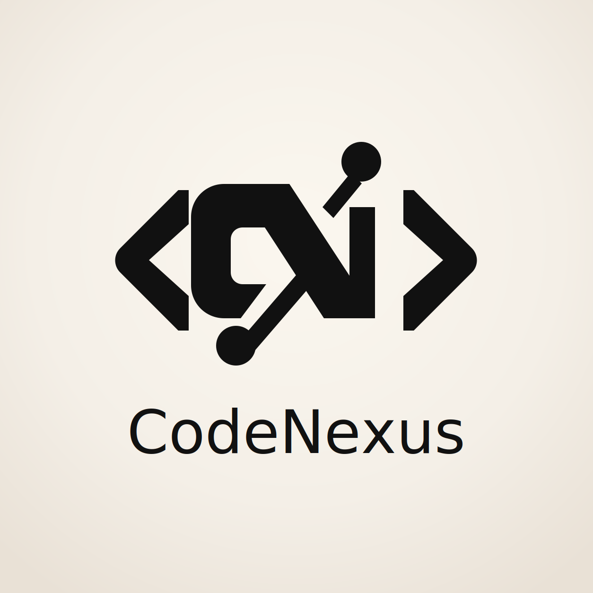

> 📄 **[Read in Chinese / 中文说明](ARCHITECTURE.zh-CN.md)**

# System Architecture Document

## 1. Architectural Overview

CodeNexus is a high-performance, multi-tenant, and multi-role online judge system designed for educational institutions. The platform supports safe execution and evaluation of programming submissions in runtime-configurable languages within a strict cgroups/seccomp-isolated environment.

The system employs a distributed service architecture, utilizing REST APIs, Redis Streams, and WebSockets as its primary communication channels:

```
+----------------+      REST + WebSocket       +------------------+      Redis Streams + HTTP      +------------------+
|                | <-------------------------> |                  | <---------------------------> |                  |
|    Frontend    |   :5173 (dev) / :80 (prod) |    API Server    | POST /submissions/{id}/res   |   Judge Worker   |
|    React 19    |                             |    Axum + Rust   |                              |  Linux Sandbox   |
|   TypeScript   |                             |    :3000         |                              | cgroups/seccomp  |
+----------------+                             +--------+---------+                              +--------+---------+
                                                        |                                                 |
                                                        | sqlx / deadpool-redis                           | sqlx
                                                        v                                                 v
                                              +------------------+                              +------------------+
                                              | PostgreSQL 16    |                              | PostgreSQL 16    |
                                              +------------------+                              +------------------+
                                                        |
                                                        v
                                              +------------------+
                                              | Redis 7          |
                                              | Queue + cache    |
                                              +------------------+

+------------------+       REST        +------------------+
| API Server       | <---------------> | Feature Gateway  |
| facade routes    | worker secret     | :3001 flags      |
+------------------+                   +------------------+
                                                |
                                                v
                                      +------------------+
                                      | LLM Worker       |
                                      | AI task runtime  |
                                      +------------------+
```

### Core Architecture Features

- **Multi-Tenant Isolation:** Enforced strictly at the database query level. All domain-scoped database queries filter records using the user's `organization_id`, preventing cross-tenant data leaks.
- **Asynchronous Submission Queue:** Code submissions are offloaded asynchronously to Redis Streams. This decouples the user-facing HTTP server from the high-resource compilation and execution pipelines.
- **In-Process WebSockets:** Co-located in the Axum binary, providing real-time submission progress and system events to clients with sub-millisecond dispatch times.
- **Runtime Feature Control:** A standalone Feature Gateway resolves global, campus, grade, and class-level flags for optional features including AI analysis and teaching assistance.
- **Workspace-Shared Models:** Uses a dedicated `shared` crate in a Cargo workspace to ensure type safety, identical schema mapping, and shared validation rules across the API, judge workers, and database migrators.

---

## 2. Backend Crate Architecture (`backend/`)

The backend is structured as a Cargo workspace consisting of 18 crates. This enforces clean domain boundaries and limits compilation dependencies.

### Workspace Structure

```
backend/
├── Cargo.toml              # Workspace root manifest
├── Cargo.lock              # Dependency lockfile
├── rust-toolchain.toml     # Pinning Rust 1.90.0
│
├── api/                    # HTTP + WebSocket Entry Crate (Router, Server launch)
├── api-infra/              # Shared Infrastructure (AppState, middleware, DB, Redis, WS)
│
├── domain-users/           # Users: Registration, authentication, profiles, RBAC
├── domain-problems/        # Problems: CRUD, testcase management, access controls
├── domain-contests/        # Contests: Lifecycle, standings, upsolving, freeze
├── domain-submissions/     # Submissions: Code queueing, result collection, rejudging
├── domain-classes/         # Classrooms: Enrollment, student grades, homework
├── domain-community/       # Social: Blogs, discussions, comment threads, DMs
├── domain-search/          # Search: Full-text indexing of problems, blogs, users
├── domain-leaderboard/     # Standings: Global, school-wide, class, and contest ranks
├── domain-imex/            # Import/Export: Batch ZIP and CSV processing
├── domain-analysis/        # Analysis: AI feedback, similarity, recommendations
├── feature-gateway/        # Runtime feature flag service
│
├── judge-worker/           # Sandboxed Judge Worker (Redis Streams consumer)
├── llm-worker/             # AI task worker behind feature flags
├── monitor-server/         # Operational monitoring service
├── migration-tool/         # Database Migrator (MySQL dump to PostgreSQL)
└── shared/                 # Workspace-wide Shared Types (Claims, Role, Permission)
```

### Crate Dependencies

```
shared (Core models & claims)
  │
  └── api-infra (Axum middleware, DB/Redis connections, WebSocket core)
        │
        ├── domain-users
        ├── domain-problems
        ├── domain-submissions
        ├── domain-contests
        ├── domain-classes
        ├── domain-community
        ├── domain-leaderboard
        ├── domain-search
        │
        └── domain-imex ── (Links domain-problems + domain-users)
                              │
api ─── (Wires all domain routers + api-infra + shared) ◄─┘

judge-worker ◄── shared (Reads database and compiles directly)
migration-tool ◄── shared
```

---

## 3. The API Server (`api/` & `api-infra/`)

The API Server is built using the **Axum** framework and runs asynchronously on top of the **Tokio** runtime.

### Responsibilities
- **Authentication:** Issues JWT access tokens and HTTP-Only cookies for refresh tokens. Invalidates sessions using a Redis-backed token blacklist.
- **Tenant Context Extraction:** A dedicated middleware extracts the tenant ID, campus ID, and grade ID directly from JWT claims. **It never trusts the client to declare their tenant via HTTP headers.**
- **Real-Time Gateway:** Upgrades HTTP connections to WebSockets to broadcast real-time compilation states, contest standings, and instant chatroom messages.
- **Asynchronous Task Queueing:** Acts as a producer, pushing JSON-encoded submission payloads onto Redis Streams (`submissions` or `contest_submissions`).
- **Telemetry & Health:** Exposes structured logs using `tracing`, outputs Prometheus-format system metrics via `/metrics`, and handles Kubernetes-ready `/health/live` and `/health/ready` check routes.

---

## 4. The Judge Worker (`judge-worker/`)

The Judge Worker is a standalone Rust binary designed to run in a secured Linux environment. It handles compiling source files and running untrusted binary code inside a rigid sandbox.

### Execution Cycle

```
[Redis Stream] ──> (Claim & Acknowledge) ──> [Create Isolated Directory]
                                                   │
                                                   v
[Download Testcases] <── [sqlx Database] <── [Drop Privileges to 'nobody']
        │
        v
[Compile Code] ── (cgroups: 30s, 512MB) ──> [Apply Seccomp Filter]
                                                   │
                                                   v
[Execute Testcases] ── (cgroups limits) ──> [Compare Outputs] ──> [HTTP Callback to API]
```

### Sandbox Security Mechanisms

1. **Privilege Demotion:** Before running compilation or code execution, the worker drops root privileges and executes as the system-safe `nobody` user (UID/GID `65534`).
2. **Control Groups (cgroups v2):** Enforces strict runtime resource limits. Compilation is capped at 30 seconds and 512MB RAM. Individual test cases are limited according to problem configurations (e.g., 1000ms, 256MB RAM). Control group creation failures trigger an immediate execution abort.
3. **Seccomp Filters:** System calls are locked down using a deny-by-default filter (`SCMP_ACT_ERRNO`). An explicit allowlist (~80 basic calls) allows only essential operations such as memory allocation (`brk`, `mmap`), file descriptors (`read`, `write`), and execution exit, completely blocking network access (`socket`), fork/execve variants, and file modifications.

---

## 5. Multi-Tenancy & Scoped Access Model

CodeNexus implements a strict hierarchical and tenant-isolated permission structure to allow multiple schools or campuses to share database and execution environments safely.

### Scoped Role Boundaries

- **`Root`:** Global administrator. Bypasses all tenant filters. Has full control over feature gateway registries, system settings, global metrics, and database backlogs.
- **`CampusAdmin`:** Campus administrator. Scoped strictly to their designated `campus_id`. Manages users, classes, assignments, and campus-wide feature gateway configurations. Cross-campus visibility is completely blocked.
- **`GradeAdmin`:** Grade-scoped administrator. Scoped to a designated `grade_id`. Creates assignments, registers classes, and views grade-level analytics. Cannot access teacher accounts, global configurations, or other grades.
- **`Teacher`:** Scoped to classrooms. Manages homework assignments, monitors student progress, and views detailed submission reports.
- **`TeachingAssistant`:** Scoped to classrooms. Reviews code submissions, registers scores, and views homework analytics. Cannot edit assignments or change classroom memberships.
- **`Student`:** Can submit solutions, register for assigned classes and contests, view public profiles, participate in permitted discussions, and chat in active contest rooms.

---

## 6. Frontend Architecture (`frontend/`)

The frontend is built using **React 19** and **TypeScript**, packaged with **Vite**, and styled using **Tailwind CSS v4** utility tokens.

### Key Directory Layout

```
frontend/
├── src/
│   ├── features/         # Route and domain modules (auth, problems, contests, admin, etc.)
│   ├── shared/           # Components, layouts, hooks, services, store, types
│   └── test/             # Vitest setup and lightweight smoke tests
```

### Production Stability Patterns
- **Skeleton Screen Loaders:** Replacing spinners on all 28 data-fetching screens for a smoother, modern UX.
- **Robust Error Handling:** Global React `ErrorBoundary` coupled with standardized `EmptyState` and `InlineError` UI components for comprehensive fallback states.
- **Token Refresh Mutex:** The API client automatically handles 401 Unauthorized errors by calling the `/auth/refresh` endpoint using a single refresh promise to prevent concurrent token queries.

---

## 7. Database Entity Schema

The system uses **PostgreSQL 16** as its persistent store. Schema changes are managed via SQL migration scripts executed at startup.

### Core Domain Tables

- `organizations`: Schools or tenants.
- `campuses`: Campuses belonging to organizations.
- `grades`: Grades (e.g., Year 2026, Grade 10) belonging to campuses.
- `users`: User profiles containing `campus_id` and `grade_id`.
- `user_roles`: Mapping of users to roles, optionally scoped to a specific `grade_id` or `campus_id`.
- `problems`: Competitive programming challenges, scoped by campus and visibility.
- `test_cases`: Input/output verification pairs for problems.
- `submissions`: Records of user code submissions, scores, and execution limits.
- `contests`: Programming contests with live rankings and chatroom support.
- `classes` & `class_members`: Classroom boundaries and enrollments.
- `blogs` & `discussions`: Community technical articles and problem-scoped comment boards.
- `feature_registry` & `feature_flags`: Feature gateway catalog and tenant overrides.

---

## 8. Feature Gateway Architecture

The **Feature Gateway** allows the system to toggle application features dynamically across different scopes (`global`, `campus`, `grade`, `class`) without restarting services.

### Override Resolution Precedence

```
[Default Config] (Canonical defaults)
       │
       v
[Global Scope] (Root-level overrides)
       │
       v
[Campus Scope] (CampusAdmin overrides)
       │
       v
[Grade Scope] (GradeAdmin overrides)
       │
       v
[Class Scope] (Teacher-level classroom overrides)
```

The feature gateway utilizes an in-process **DashMap** cache to achieve sub-millisecond query evaluation. Cache entries are invalidated by the service on `set_flag` and `delete_flag`; deployments with multiple gateway replicas should add an external invalidation mechanism before expecting cross-process cache coherence.
<!-- GSD:docs -->
