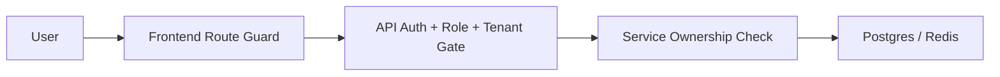
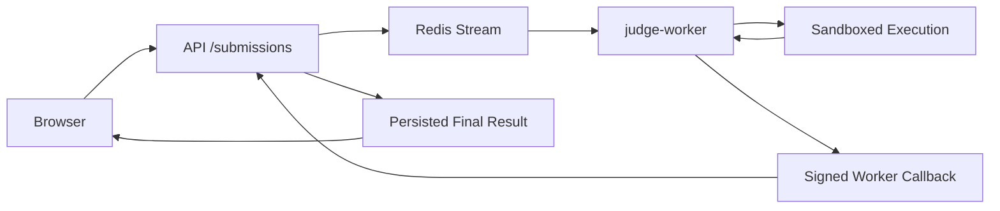

# Production Convergence Roadmap

This document is the operating roadmap for taking the current `Online_Judge` repository from the present baseline to production-grade delivery.

## Target Production State

The production target is not "demo works".
The production target is:

- one canonical runtime role model: `root / campus / teacher / student`
- one canonical tenant model: global defaults configured by administrators, enforced by backend reads and writes
- no user-visible mock flows
- no frontend fake-success save actions
- no student-visible hidden test data or expected answers
- no service-to-service calls that reuse user authentication
- a real submission lifecycle: `submit -> queue -> judge -> callback -> persisted result -> visible status`
- a real release gate: green static checks, green contract tests, green core E2E, and a runnable rollback path

## Architecture Flows To Reach

### 1. Identity And Resource Authorization

Rules:

- frontend only hides or shows routes; it does not decide authority
- backend decides role, tenant, and resource ownership
- write paths must check all three: role, tenant scope, resource ownership

### 2. Judge Flow

Rules:

- worker callback uses service credentials, not user auth
- callback validates submission identity and source
- test cases and answers stay in trusted backend/worker scope

## Ownership Model

- Codex owns:
  - auth, JWT, RBAC, tenanting
  - backend contracts
  - judge-worker, queue, callback, sandbox
  - final review and phase approval
- Claude Code owns:
  - frontend refactor
  - route guard cleanup
  - admin/teacher/user page contract alignment
  - removal of dead frontend pages and fake-success UX
- User owns:
  - manual Claude dispatch
  - final business approvals
  - production rollout authorization

## Phase Order

### P0 Hard Garbage Purge

- Remove `.bak`
- Remove `.DS_Store`
- Remove dead mock-only runtime paths
- Remove fake-success frontend save paths or mark them as out of product
- Rewrite false delivery claims in docs

Claude lane:

- frontend page/route inventory
- dead page removal
- fake-success UI removal or downgrade notes

### P1 Canonical Auth / RBAC / Tenant Contract

- unify role literals
- unify JWT claims
- unify frontend auth types and guards
- wire tenant rules to resource reads/writes

Claude lane:

- route guards
- frontend role types
- admin/teacher/student navigation cleanup

### P2 Problem / Test Case / Admin Config Convergence

- split student read model from management model
- protect test cases and hidden outputs
- restrict problem/config writes by role and tenant
- replace vague shared admin contracts

Claude lane:

- admin problem pages
- judge settings page
- problem content config page

### P3 Submission / Judge / Sandbox Convergence

- service-to-service callback auth
- result validation and retry semantics
- real execution path isolation
- remove unused sandbox branches only after replacement is active

Claude lane:

- submission detail/status UX alignment
- remove stale frontend assumptions about judge statuses

### P4 Teaching Domain Convergence

- class ownership
- student enrollment authority
- assignment publish/delete boundaries
- teacher reports aligned with authorized scope

Claude lane:

- class management page
- assignment report page
- teacher contest wizard contract cleanup

### P5 Contest / Leaderboard Convergence

- contest write scopes
- participant visibility
- scoreboard and leaderboard tenant filters
- consistent contest contract

Claude lane:

- contest list/detail/scoreboard pages
- ranking page contract cleanup

### P6 Community / Messages / Notifications / Search

- remove fake saves
- align reporting/moderation with real backend
- tenant-aware messaging/search results
- remove dead admin/report views

Claude lane:

- discussions/blog/messages/settings/search pages
- report UI cleanup

### P7 Release Hardening

- fill contract tests
- fill role matrix tests
- fill worker integration tests
- reconcile runbook, acceptance checklist, and actual system state

Claude lane:

- frontend smoke stabilization
- route inventory validation

## Exit Condition

The program is complete only when:

- all phases are closed with written summaries
- no P0 or P1 defects remain
- all required review checkpoints passed
- release documentation matches actual runtime behavior
