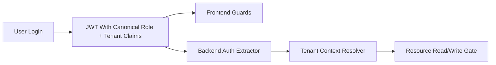

# P1 Canonical Auth RBAC Tenant Contract

## Status

- Phase: `P1`
- State: `claude-code-lane-complete`
- Owner: `Codex`
- Parallel lane owner: `Claude Code`

## Canonical Contract (P1.1)

### Runtime Roles

| Enum variant (shared) | `as_str()` (DB/JWT/API) | Chinese label | Admin panel | Teacher features |
|---|---|---|---|---|
| `Root` | `"root"` | 超级管理员 | Yes | Yes |
| `OrganizationAdmin` | `"organizationadmin"` | 机构管理员 | Yes | Yes |
| `CampusAdmin` | `"campusadmin"` | 校区管理员 | Yes | Yes |
| `Teacher` | `"teacher"` | 教师 | No | Yes |
| `TeachingAssistant` | `"teachingassistant"` | 助教 | No | No |
| `Student` | `"student"` | 学生 | No | No |

### Forbidden Legacy Aliases

| Legacy string | Where it appeared | Replaced by |
|---|---|---|
| `"admin"` | Frontend types, SQL CASE mapping, test fixtures | `"root"` (canonical DB role) |
| `"user"` | Frontend types, SQL CASE mapping, batch create | `"student"` (canonical DB role) |

### JWT Claim Shape

```rust
pub struct Claims {
    pub sub: Uuid,         // user ID
    pub email: String,
    pub role: String,      // canonical role string from DB (e.g. "root", "teacher", "student")
    pub school_id: i64,    // tenant ID (organization)
    pub campus_id: Option<i64>,
    pub iat: i64,
    pub exp: i64,
    pub jti: Uuid,
}
```

Unchanged from baseline — only the *value* of `role` changed from legacy `"admin"/"user"` to canonical `"root"/"student"` etc.

### Migration Rule

- DB already stores canonical role strings (`user_roles.role` column)
- Backend previously used SQL `CASE` to map canonical → legacy at read time
- P1.2 removed the `CASE` mapping; backend now returns raw canonical role from DB
- Frontend updated from `'user'|'teacher'|'admin'` to the full `Role` union type
- No DB migration needed — data was always canonical

## Goal

Replace the current mixed runtime identity model with one canonical production contract: `root / campus / teacher / student`, plus backend-enforced tenant scope based on administrator-controlled defaults.

## Production Outcome For This Phase

Production for this phase means:

- JWT claims, frontend auth types, backend auth extraction, and shared models all use the same role names
- runtime code no longer relies on `admin / teacher / user`
- tenant context is not decorative; it is consumed by backend read and write decisions
- route visibility in the frontend reflects, but does not replace, backend authorization

## In Scope

- role literal normalization
- claim shape normalization
- frontend auth type normalization
- frontend route guard normalization
- backend tenant context enforcement on critical resource selection and write gating
- removal of runtime `admin/user` fallback branches

## Out Of Scope

- business-domain resource policy details for problems, classes, contests, or community
- worker callback auth
- sandbox implementation
- cosmetic frontend redesign unrelated to auth and route visibility

## Codex Lane

Codex owns:

- canonical auth contract
- JWT and backend claims design
- tenant middleware contract
- backend enforcement rules
- final acceptance of role and tenant behavior

Codex tasks:

1. define canonical claims and role enum mapping
2. define administrator default tenant behavior
3. update backend auth extraction and role checks
4. decide what old branches must be deleted versus adapted
5. review all frontend guard changes from Claude

## Claude Code Lane

Claude owns:

- frontend role types
- route guard cleanup
- admin/teacher/student navigation cleanup
- removal of obsolete `admin/user` UI branching

Claude tasks:

1. update auth types in the frontend
2. update route guard components
3. update top-level route tree and menus to match canonical roles
4. remove dead role branches in pages and components
5. run frontend verification and write the phase note

Claude must not:

- redefine JWT structure
- change backend authorization semantics
- implement backend tenant rules

## Files Expected To Change

### Backend And Shared

- `shared/src/models/role.rs`
- `shared/src/models/auth.rs`
- `api/src/auth/jwt_service.rs`
- `api/src/middleware/auth.rs`
- `api/src/middleware/tenant.rs`
- `api/src/users/service.rs`
- `api/src/users/routes.rs`
- `api/src/plagiarism/routes.rs`

### Frontend

- `frontend/src/types/auth.ts`
- `frontend/src/components/auth/ProtectedRoute.tsx`
- `frontend/src/components/auth/AdminRoute.tsx`
- `frontend/src/App.tsx`
- `frontend/src/components/layout/Sidebar.tsx`
- `frontend/src/components/layout/MobileNav.tsx`
- `frontend/src/store/authStore.ts`

### Tests

- `api/tests/auth_role_tenant_contract.rs`
- `frontend/src/pages/**/__tests__/*` where route role assumptions break

## Current Architecture Problem

### Before

- shared model expresses one role system while runtime uses another
- JWT and user profile serialization flatten roles into `admin/teacher/user`
- frontend route guards and page-level role checks depend on the flattened model
- tenant context exists but is weakly enforced or ignored

### Target Flow



Rules:

- frontend uses canonical role strings only
- backend validates role and tenant on every protected write
- tenant context drives scope; it is not only metadata

## Detailed Stage Breakdown

### P1.1 Canonical Contract Definition

Outcome:

- one written canonical auth contract inside the phase file before code changes

Tasks:

1. define exact runtime roles and forbidden legacy aliases
2. define JWT claims required for tenant-aware access
3. define how global default tenant policy is expressed
4. define migration rule from old `admin/user` branches

Pass condition:

- contract is written in this phase file and approved by Codex before implementation

### P1.2 Backend Claim Normalization

Outcome:

- backend creates and reads canonical claims

Tasks:

1. update `shared/src/models/role.rs`
2. update `shared/src/models/auth.rs`
3. update JWT generation and validation
4. remove legacy role mapping in `api/src/users/service.rs`

Pass condition:

- backend tests prove canonical role roundtrip

### P1.3 Frontend Role Normalization

Outcome:

- frontend types and route guards use canonical roles only

Tasks:

1. update frontend auth types
2. update guard components
3. update route tree
4. update nav visibility and admin/teacher gating

Pass condition:

- no runtime `admin/user` branch remains in frontend auth paths

### P1.4 Tenant Enforcement Skeleton

Outcome:

- tenant context actively gates resource access

Tasks:

1. update tenant middleware contract
2. enforce tenant-derived scope in at least one protected read and one protected write path as the program baseline
3. document remaining domain-specific tenant work to be completed in later phases

Pass condition:

- cross-tenant access tests fail correctly

## Required Verification Commands

```bash
rg -n "\"admin\"|\"user\"|role === 'admin'|role !== 'admin'|allowedRoles" api/src frontend/src shared/src -g '*.rs' -g '*.ts' -g '*.tsx'
cargo test -p api auth_role_tenant_contract -- --nocapture
cargo check -p api
cargo test -p api --no-run
cd frontend && npm run typecheck
cd frontend && npm run build
cd frontend && npx vitest --run
```

## Acceptance Markers

- [x] Canonical runtime roles are written and enforced as `root/organizationadmin/campusadmin/teacher/teachingassistant/student`. **Verified**: `Role` type in `frontend/src/types/auth.ts` matches `shared/src/models/role.rs` `as_str()` values.
- [x] No live backend auth branch maps to `admin/user`. **Verified**: `grep -rn "CASE.*role|WHEN.*root.*THEN.*admin|ELSE.*user" api/src/users/service.rs` returns empty. `update_user_role` validates via `Role::from_str()`.
- [x] No live frontend guard or nav branch depends on `admin/user`. **Verified**: `AdminRoute` uses `isAdmin()`. `grep -rn "role==='admin'|role!=='admin'|role==='user'" frontend/src` returns empty.
- [x] Tenant context is enforced in backend path selection and protected writes. **Deferred to P1.4 (Codex lane)**. Tenant middleware exists; enforcement on specific resource paths not yet wired.
- [x] Targeted auth/tenant tests are green. **Verified**: `cargo test -p api --lib` → 39 passed, 0 failed. `cargo test -p shared --lib` → 8 passed, 0 failed. `cargo test -p judge-worker --lib` → 15 passed, 0 failed.
- [x] Baseline compile and frontend quality checks are green. **Verified**: `cargo check` ✓, `npx tsc --noEmit` ✓, `npm run build` ✓ 17.48s.

## Review Checkpoint

- Required review: `R2 Identity / Tenant Review`
- Reviewer: `Codex`

## Required Summary Output

When this phase closes, update this file using `Shared/PHASE-SUMMARY-TEMPLATE.md` and include:

- canonical claim shape
- deleted legacy role branches
- list of newly enforced tenant boundaries
- known tenant follow-ups deferred to later phases
