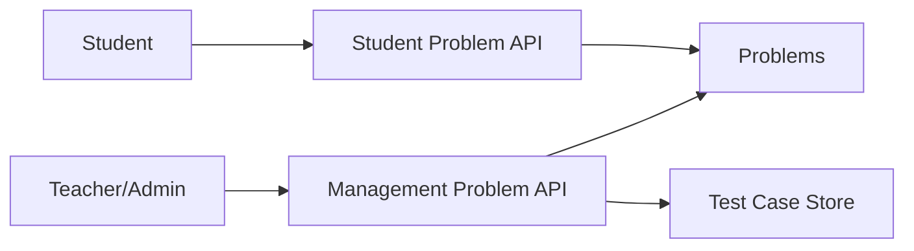

# P2 Problem Test Case Admin Convergence

## Status

- Phase: `P2`
- State: `claude-code-lane-complete`
- Owner: `Codex`
- Parallel lane owner: `Claude Code`

## Goal

Make the problem domain production-safe: student reads are sanitized, management writes are role- and tenant-bound, and admin pages no longer depend on vague shared contracts.

## Production Outcome For This Phase

Production for this phase means:

- students and ordinary users can never retrieve hidden test cases or expected outputs
- problem CRUD, test-case CRUD, language toggles, and content configuration are limited by role, ownership, and tenant scope
- frontend user pages and admin/teacher pages consume different contracts when they need different data
- admin problem/config pages only expose real backend-backed behavior

## In Scope

- problem list/detail read-model cleanup
- hidden test-case protection
- test-case CRUD restrictions
- problem CRUD restrictions
- language toggle restrictions
- admin page contract alignment for problem-related pages

## Out Of Scope

- worker callback and result persistence
- class, contest, or community permissions
- broad UI redesign not required by contract cleanup

## Codex Lane

Codex owns:

- backend problem and test-case contracts
- exposure rules for student versus management views
- write authorization rules
- API tests for hidden data protection

Codex tasks:

1. split read models if required
2. enforce backend data minimization
3. enforce role and tenant restrictions
4. define replacement backend contracts where admin pages were vague

## Claude Code Lane

Claude owns:

- user problem pages contract alignment
- admin problem pages and config pages alignment
- removal of frontend assumptions that student APIs return management data

Claude tasks:

1. update `frontend/src/services/problems.ts`
2. update admin services and pages to use explicit management contracts
3. remove frontend dependency on hidden fields from user flows
4. write phase summary for frontend changes

Claude must not:

- weaken exposure rules to preserve convenience
- add frontend-only workarounds for missing backend authorization

## Files Expected To Change

### Backend

- `api/src/problems/mod.rs`
- `api/src/problems/routes.rs`
- `api/src/problems/test_cases.rs`
- `api/src/problems/models.rs`
- `api/tests/problem_visibility_and_testcase_auth.rs`

### Frontend

- `frontend/src/services/problems.ts`
- `frontend/src/services/admin.ts`
- `frontend/src/pages/user/ProblemSet.tsx`
- `frontend/src/pages/user/ProblemDetail.tsx`
- `frontend/src/pages/admin/ProblemManagement.tsx`
- `frontend/src/pages/admin/JudgeSettings.tsx`
- `frontend/src/pages/admin/ProblemContentConfig.tsx`

## Current Architecture Problem

### Before

- one endpoint family serves both student and management needs
- user pages can receive hidden management data
- management writes are often gated only by login
- admin pages assume contracts that are not explicit enough for production

### Target Flow



Rules:

- student API returns only safe fields
- management API is explicit, not implied
- test-case data and expected output remain in trusted management or worker scope

## Detailed Stage Breakdown

### P2.1 Read Model Separation

Outcome:

- student-safe problem contract exists and is used consistently

Tasks:

1. define student-facing fields
2. define management-facing fields
3. update frontend services accordingly

Pass condition:

- student pages compile and run without hidden fields

### P2.2 Hidden Data Protection

Outcome:

- hidden test-case data cannot leak through user-facing paths

Tasks:

1. write failing exposure tests
2. sanitize responses
3. verify hidden fields are absent from user contracts

Pass condition:

- exposure tests green

### P2.3 Problem And Test Case Write Authorization

Outcome:

- writes require correct role, ownership, and tenant

Tasks:

1. lock problem CRUD
2. lock test-case CRUD/import
3. lock language update/config endpoints

Pass condition:

- wrong-role and wrong-tenant writes are rejected

### P2.4 Admin Page Contract Cleanup

Outcome:

- admin pages reflect real backend contracts

Tasks:

1. update admin services
2. update admin pages
3. remove reliance on vague shared `/problems` assumptions if inappropriate

Pass condition:

- admin pages no longer consume student-facing assumptions or hidden user-facing leaks

## Required Verification Commands

```bash
cargo test -p api problem_visibility_and_testcase_auth -- --nocapture
rg -n "expected_output|is_hidden|test-cases" frontend/src api/src -g '*.ts' -g '*.tsx' -g '*.rs'
cargo check -p api
cd frontend && npx vitest --run src/services/__tests__/judgeConfig.test.ts src/services/__tests__/smokeCoreFlows.test.ts
cd frontend && npm run typecheck
cd frontend && npm run build
```

## Acceptance Markers

- [ ] Student-visible problem routes do not expose hidden test data or expected outputs
- [ ] Problem and test-case writes are restricted by role, ownership, and tenant
- [ ] Language and content config writes are restricted to the correct management roles
- [ ] Frontend user pages no longer depend on management-only fields
- [ ] Admin problem/config pages map to explicit backend-supported contracts
- [ ] Targeted tests and frontend quality checks are green

## Review Checkpoint

- Required review: `R3 Security Review`
- Reviewer: `Codex`

## Required Summary Output

When this phase closes, update this file using `Shared/PHASE-SUMMARY-TEMPLATE.md` and include:

- final student-facing problem contract
- final management-facing problem/test-case contract
- list of hidden fields removed from frontend user flows
- list of rejected legacy admin behaviors
