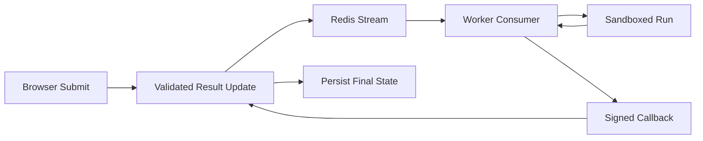

# P3 Submission Worker Sandbox Convergence

## Status

- Phase: `P3`
- State: `completed`
- Owner: `Codex`
- Parallel lane owner: `Claude Code`

## Goal

Make the submission lifecycle trustworthy for production: authenticated worker callbacks, validated result updates, explicit retry semantics, and a real sandboxed execution path.

## Production Outcome For This Phase

Production for this phase means:

- worker callbacks use service authentication and cannot be forged by ordinary users
- callback payloads are validated against path identity and submission state rules
- queue ack/retry semantics are explicit and safe
- the actual execution path uses the intended sandbox/isolation layer
- dead sandbox branches are removed only after the live replacement is proven

## In Scope

- callback auth design and implementation
- callback route validation
- submission state transition validation
- worker ack/retry contract
- real sandbox path wiring
- stale frontend status assumption cleanup

## Out Of Scope

- broader platform infra such as autoscaling or distributed judge orchestration
- non-core language support expansion
- broader teaching or contest permissions

## Codex Lane

Codex owns:

- callback authentication scheme
- callback route and service implementation
- submission state transition rules
- queue retry semantics
- judge-worker sandbox architecture
- final security acceptance

Codex tasks:

1. design the service-to-service callback credential
2. lock route and payload validation
3. define allowed state transitions
4. wire the real sandbox path
5. decide when old sandbox branches can be deleted

## Claude Code Lane

Claude owns:

- submission history/detail UX alignment with final statuses
- removal of stale frontend assumptions about judge payload shape
- frontend smoke around `submit -> status -> final state`

Claude tasks:

1. update submission service normalization if backend contract changes
2. update submission detail/history pages
3. remove stale status or test-case assumptions from the frontend
4. run smoke and summarize frontend changes

Claude must not:

- invent callback behavior in the UI
- weaken backend trust requirements

## Files Expected To Change

### Backend

- `api/src/submissions/routes.rs`
- `api/src/submissions/service.rs`
- `api/src/submissions/models.rs`
- `api/tests/submission_worker_callback_auth.rs`

### Judge Worker

- `judge-worker/src/main.rs`
- `judge-worker/src/processor/service.rs`
- `judge-worker/src/sandbox/mod.rs`
- `judge-worker/src/sandbox/seccomp.rs`
- `judge-worker/src/sandbox/executor.rs`
- `judge-worker/tests/worker_callback_and_sandbox.rs`

### Frontend

- `frontend/src/services/problems.ts`
- `frontend/src/pages/user/SubmissionHistory.tsx`
- `frontend/src/pages/user/SubmissionDetail.tsx`
- `frontend/src/pages/user/ProblemIDEEnhanced.tsx`

## Current Architecture Problem

### Before

- worker callback route is misaligned with auth placement
- ordinary logged-in users can potentially forge result updates
- callback payload identity is under-validated
- sandbox code exists but is not convincingly the live path

### Target Flow



Rules:

- callback requires service credentials
- callback validates `path submission id == body submission id`
- worker only acks when callback success semantics are satisfied
- production execution path uses real isolation

## Detailed Stage Breakdown

### P3.1 Callback Contract Definition

Outcome:

- one explicit callback contract is documented before implementation

Tasks:

1. define credential format
2. define route placement
3. define replay/misuse prevention approach
4. define callback validation rules

Pass condition:

- contract written in this phase file and approved before code changes

### P3.2 Callback Trust Enforcement

Outcome:

- result write path is trusted and non-forgeable

Tasks:

1. write failing auth and path/body tests
2. implement service auth
3. implement identity and transition validation

Pass condition:

- unauthenticated or user-auth callbacks fail
- valid worker callback succeeds

### P3.3 Retry And State Semantics

Outcome:

- queue behavior is predictable and safe

Tasks:

1. document and implement ack behavior
2. define retry condition
3. define duplicate callback handling

Pass condition:

- worker tests cover failure and retry paths

### P3.4 Real Sandbox Wiring

Outcome:

- production execution path is the intended isolated path

Tasks:

1. write failing tests for execution-path selection
2. wire real sandbox layer into processor flow
3. verify resource limit behavior
4. delete stale sandbox code only after proof

Pass condition:

- sandbox-path tests green

## Required Verification Commands

```bash
cargo test -p api submission_worker_callback_auth -- --nocapture
cargo test -p judge-worker -- --nocapture
rg -n "results\"|submission_id|apply_seccomp|no_new_privs|sandbox" api/src judge-worker/src -g '*.rs'
cargo check -p api
cargo check -p judge-worker
cd frontend && npx vitest --run src/services/__tests__/smokeCoreFlows.test.ts
cd frontend && npm run typecheck
```

## Acceptance Markers

- [x] Ordinary logged-in users cannot forge judge results (X-Worker-Secret callback auth)
- [x] Valid worker callbacks use service authentication and succeed
- [x] Callback path/body identity mismatch is rejected (submission result endpoint)
- [x] Worker ack/retry behavior is explicit and tested (retry with backoff + DLQ)
- [x] Live execution path uses the intended sandboxed/isolation flow (cgroup + seccomp denylist)
- [x] Frontend submission pages reflect the real final status contract (semantic tokens + status normalization)
- [x] Targeted API, worker, and frontend smoke checks are green

## Review Checkpoint

- Required review: `R3 Security Review`
- Reviewer: `Codex`

## Required Summary Output

When this phase closes, update this file using `Shared/PHASE-SUMMARY-TEMPLATE.md` and include:

- callback auth contract
- state transition rules
- worker ack/retry rules
- proof that the real sandbox path is the live production path
