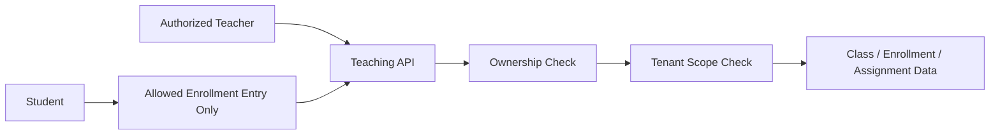

# P4 Teaching Domain Convergence

## Status

- Phase: `P4`
- State: `ready`
- Owner: `Codex`
- Parallel lane owner: `Claude Code`

## Goal

Bring the teaching domain to production rules: class, enrollment, assignment, and teacher-facing flows must obey role, ownership, and tenant boundaries.

## Production Outcome For This Phase

Production for this phase means:

- only authorized teacher or campus-scoped management roles can create and manage classes
- student enrollment flows are bounded by allowed entry points
- assignment create/update/publish/delete is tied to owning teacher and tenant scope
- teacher pages reflect only authorized and supported behaviors

## In Scope

- class CRUD authorization
- student add/import/remove authorization
- enrollment entry behavior
- assignment CRUD/publish authorization
- teacher page contract alignment

## Out Of Scope

- contest authority beyond teacher page integration
- full student self-service redesign
- non-teaching community features

## Codex Lane

Codex owns:

- backend class and assignment authority model
- ownership checks
- tenant enforcement for teaching resources
- backend tests and final approval

Codex tasks:

1. define authorized teacher and campus write rules
2. apply them to class and assignment routes/services
3. decide allowed self-enrollment behavior
4. verify non-owner and cross-tenant rejection paths

## Claude Code Lane

Claude owns:

- teacher page contract cleanup
- class management page alignment
- assignment report page alignment
- teacher contest wizard alignment where it depends on class/assignment contracts

Claude tasks:

1. update `frontend/src/services/classes.ts`
2. update teacher pages to reflect allowed behaviors only
3. remove UI actions that backend no longer permits
4. write frontend verification evidence

## Files Expected To Change

### Backend

- `api/src/classes/routes.rs`
- `api/src/classes/service.rs`
- `api/src/classes/models.rs`
- `api/tests/class_and_assignment_authorization.rs`

### Frontend

- `frontend/src/services/classes.ts`
- `frontend/src/pages/teacher/ClassManagement.tsx`
- `frontend/src/pages/teacher/AssignmentReport.tsx`
- `frontend/src/pages/teacher/ContestWizard.tsx`
- `frontend/src/pages/teacher/__tests__/ClassManagement.test.tsx`

## Current Architecture Problem

### Before

- multiple class and assignment writes are gated only by login
- class ownership and campus scope are under-enforced
- teacher pages expose actions that are not yet production-safe

### Target Flow



Rules:

- teacher writes require ownership and tenant scope
- students cannot mutate teaching resources
- UI only exposes backend-supported teacher operations

## Detailed Stage Breakdown

### P4.1 Class Authority

Outcome:

- class create/update/delete is fully authorized

Tasks:

1. write failing class authorization tests
2. implement owner and campus checks
3. reject student and non-owner teacher writes

Pass condition:

- class authorization tests green

### P4.2 Enrollment Authority

Outcome:

- student add/import/remove and enrollment paths are bounded

Tasks:

1. define valid enrollment entry points
2. enforce teacher authority for add/import/remove
3. enforce student-only semantics for self-enroll if retained

Pass condition:

- unauthorized enrollment mutations fail

### P4.3 Assignment Authority

Outcome:

- assignment lifecycle obeys teacher ownership and tenant scope

Tasks:

1. lock create/update/delete/publish
2. enforce ownership checks
3. update assignment report assumptions

Pass condition:

- assignment auth tests green

### P4.4 Teacher Frontend Cleanup

Outcome:

- teacher pages only show valid actions and valid data

Tasks:

1. remove unsupported actions
2. align page copy and state handling
3. verify teacher happy path

Pass condition:

- teacher page tests and smoke pass

## Required Verification Commands

```bash
cargo test -p api class_and_assignment_authorization -- --nocapture
rg -n "AuthExtractor\\(|post\\(|put\\(|delete\\(" api/src/classes -g '*.rs'
cargo check -p api
cd frontend && npx vitest --run src/services/__tests__/classes.test.ts src/pages/teacher/__tests__/ClassManagement.test.tsx
cd frontend && npm run typecheck
```

## Acceptance Markers

- [ ] Students cannot mutate classes or assignments
- [ ] Non-owner or wrong-tenant teachers cannot mutate teaching resources
- [ ] Enrollment paths are explicitly bounded and tested
- [ ] Teacher pages expose only backend-supported actions
- [ ] Targeted backend and frontend tests are green

## Review Checkpoint

- Required review: `R4 Business Domain Review`
- Reviewer: `Codex`

## Required Summary Output

When this phase closes, update this file using `Shared/PHASE-SUMMARY-TEMPLATE.md` and include:

- final teacher authority matrix
- final enrollment rule summary
- removed teacher UI actions
- remaining teaching-domain follow-ups, if any
