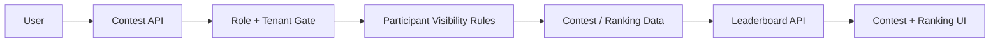

# P5 Contest Leaderboard Convergence

## Status

- Phase: `P5`
- State: `ready`
- Owner: `Codex`
- Parallel lane owner: `Claude Code`

## Goal

Converge contests and leaderboard behavior so that creation, registration, participant visibility, and ranking scope all obey the production role and tenant model.

## Production Outcome For This Phase

Production for this phase means:

- contest writes are authorized by role and tenant
- participant data exposure is bounded
- scoreboard and leaderboard scopes match organizational visibility rules
- frontend contest and ranking pages consume stable backend-backed contracts

## In Scope

- contest create/update/delete authority
- contest registration and participant visibility rules
- contest detail/status/rankings contract cleanup
- leaderboard scope and visibility rules
- frontend contest and ranking page alignment

## Out Of Scope

- broader gamification features
- realtime broadcast optimization
- unrelated teaching or community work

## Codex Lane

Codex owns:

- backend contest authority rules
- leaderboard scope rules
- participant data exposure rules
- backend tests and review

Codex tasks:

1. define who may create and manage contests
2. define who may see participants and rankings
3. align leaderboard endpoints with tenant scope
4. verify all cross-tenant and wrong-role cases

## Claude Code Lane

Claude owns:

- contest list/detail/scoreboard contract alignment
- ranking page contract alignment
- removal of speculative frontend data assembly where a stable backend contract should exist

Claude tasks:

1. update contest and ranking services
2. update contest list/detail/scoreboard pages
3. update ranking page behavior
4. document any backend contract gaps discovered during frontend alignment

## Files Expected To Change

### Backend

- `api/src/contests/routes.rs`
- `api/src/contests/service.rs`
- `api/src/contests/models.rs`
- `api/src/leaderboard/routes.rs`
- `api/src/leaderboard/service.rs`
- `api/tests/contest_and_leaderboard_scope.rs`

### Frontend

- `frontend/src/services/contests.ts`
- `frontend/src/services/ranking.ts`
- `frontend/src/pages/user/ContestList.tsx`
- `frontend/src/pages/user/ContestDetail.tsx`
- `frontend/src/pages/contest/ContestScoreboard.tsx`
- `frontend/src/pages/user/Ranking.tsx`

## Current Architecture Problem

### Before

- contest pages stitch together data across multiple requests with implicit assumptions
- write scopes are not consistently limited by role and tenant
- leaderboard visibility may outgrow the intended tenant boundary

### Target Flow



Rules:

- contest write paths are explicit and authorized
- visibility for participants and rankings follows tenant scope
- frontend depends on stable backend fields, not guesses

## Detailed Stage Breakdown

### P5.1 Contest Authority

Outcome:

- contest writes are authorized by role and tenant

Tasks:

1. write failing authority tests
2. enforce create/update/delete rules
3. verify wrong-role and wrong-tenant rejection

Pass condition:

- contest authority tests green

### P5.2 Participant And Registration Scope

Outcome:

- registration and participant visibility are bounded

Tasks:

1. define participant visibility rules
2. enforce registration scope checks
3. ensure details do not leak disallowed participant data

Pass condition:

- participant exposure tests green

### P5.3 Leaderboard Scope

Outcome:

- leaderboard visibility matches tenant policy

Tasks:

1. define scope per leaderboard endpoint
2. enforce scope in backend
3. update frontend assumptions

Pass condition:

- leaderboard scope tests green

### P5.4 Frontend Contract Cleanup

Outcome:

- contest and ranking pages align to stable backend contracts

Tasks:

1. simplify contest service assembly where possible
2. remove stale assumptions from pages
3. validate end-user flows

Pass condition:

- contest and ranking frontend tests green

## Required Verification Commands

```bash
cargo test -p api contest_and_leaderboard_scope -- --nocapture
cargo check -p api
cd frontend && npx vitest --run src/services/__tests__/contests.test.ts src/services/__tests__/ranking.test.ts
cd frontend && npm run typecheck
cd frontend && npm run build
```

## Acceptance Markers

- [ ] Contest writes are role- and tenant-bounded
- [ ] Participant visibility is explicit and enforced
- [ ] Leaderboard scope matches organizational visibility rules
- [ ] Frontend contest and ranking pages consume stable backend-backed contracts
- [ ] Targeted tests and quality checks are green

## Review Checkpoint

- Required review: `R4 Business Domain Review`
- Reviewer: `Codex`

## Required Summary Output

When this phase closes, update this file using `Shared/PHASE-SUMMARY-TEMPLATE.md` and include:

- final contest authority matrix
- participant visibility rules
- leaderboard scope rules
- frontend contract simplifications performed
