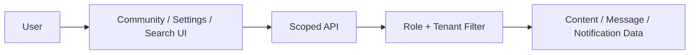

# P6 Community Messages Notifications Search Convergence

## Status

- Phase: `P6`
- State: `ready`
- Owner: `Codex`
- Parallel lane owner: `Claude Code`

## Goal

Convert the remaining community and utility surfaces from demo-like behavior to production behavior: no fake saves, no dead report surfaces, no tenant-blind messaging or search leaks.

## Production Outcome For This Phase

Production for this phase means:

- settings actions only claim success when a real backend write exists
- report/review/moderation surfaces are either real or removed from the product surface
- messaging and search respect tenant and authorization rules
- community pages reflect real backend-supported capabilities only

## In Scope

- settings fake-success cleanup
- report management truthfulness
- messaging visibility and tenant filtering
- notifications contract truthfulness
- search filtering by accessible resources
- discussion/blog page contract alignment

## Out Of Scope

- recommendation engines
- advanced moderation automation
- full notification redesign

## Codex Lane

Codex owns:

- backend visibility rules for messages, notifications, and search
- report/review backend contract decision
- backend tests and acceptance

Codex tasks:

1. define real versus removed product surfaces
2. enforce messaging and search scope
3. verify notification and moderation contracts
4. reject any fake-success fallback

## Claude Code Lane

Claude owns:

- settings page cleanup
- discussions/blog/messages/search page alignment
- report management UI cleanup
- removal of dead or misleading frontend entry points

Claude tasks:

1. remove fake-success save actions
2. update message/search/community services and pages
3. hide or remove unsupported report UI if the backend remains absent
4. provide screenshots or route inventory when UI surfaces change materially

## Files Expected To Change

### Backend

- `api/src/discussions/routes.rs`
- `api/src/blog/routes.rs`
- `api/src/messages/routes.rs`
- `api/src/notifications/routes.rs`
- `api/src/search/routes.rs`
- `api/tests/community_message_search_scope.rs`

### Frontend

- `frontend/src/pages/community/DiscussionList.tsx`
- `frontend/src/pages/community/DiscussionDetail.tsx`
- `frontend/src/pages/community/BlogList.tsx`
- `frontend/src/pages/community/BlogDetail.tsx`
- `frontend/src/pages/community/DirectMessages.tsx`
- `frontend/src/pages/user/Settings.tsx`
- `frontend/src/pages/search/SearchResults.tsx`
- `frontend/src/pages/admin/ReportManagement.tsx`
- `frontend/src/services/messages.ts`
- `frontend/src/services/searchApi.ts`
- `frontend/src/services/communityApi.ts`

## Current Architecture Problem

### Before

- some UI actions report success without persisted backend state
- some admin/community/report surfaces imply a contract that may not exist
- messaging and search do not clearly express tenant filtering requirements

### Target Flow



Rules:

- no successful save without backend persistence
- no exposed UI surface without backend support
- search and messaging return only resources visible to the caller

## Detailed Stage Breakdown

### P6.1 Fake-Success Removal

Outcome:

- settings and similar pages no longer lie about persistence

Tasks:

1. identify fake-success mutations
2. remove them or connect them to real backend writes
3. update UX to reflect true product scope

Pass condition:

- no known fake-success save remains

### P6.2 Messaging And Search Scope

Outcome:

- scope leaks are closed

Tasks:

1. write failing scope tests
2. enforce tenant and visibility filters
3. update frontend list/detail assumptions

Pass condition:

- search and messaging scope tests green

### P6.3 Report And Community Surface Truthfulness

Outcome:

- moderation/report pages are real or removed

Tasks:

1. decide report management fate
2. update or remove misleading UI
3. align discussions/blog behaviors to backend support

Pass condition:

- no dead formal product surface remains

## Required Verification Commands

```bash
cargo test -p api community_message_search_scope -- --nocapture
rg -n "success: true|updatePreferencesMutation|updateNotificationsMutation" frontend/src -g '*.ts' -g '*.tsx'
cargo check -p api
cd frontend && npx vitest --run src/services/__tests__/messages.test.ts src/services/__tests__/searchApi.test.ts src/services/__tests__/communityApi.test.ts
cd frontend && npm run typecheck
```

## Acceptance Markers

- [ ] Settings and similar pages do not report false persistence success
- [ ] Messaging and search respect tenant and authorization filters
- [ ] Report or moderation pages are either real and backend-backed or removed from the formal product surface
- [ ] Community pages expose only backend-supported actions
- [ ] Targeted backend and frontend tests are green

## Review Checkpoint

- Required review: `R4 Business Domain Review`
- Reviewer: `Codex`

## Required Summary Output

When this phase closes, update this file using `Shared/PHASE-SUMMARY-TEMPLATE.md` and include:

- removed fake-success paths
- final report-management decision
- message/search scope rules
- frontend entry points removed or retained
