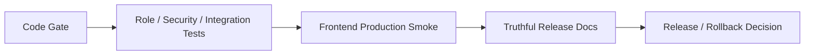

# P7 Release Hardening And Truthful Delivery

## Status

- Phase: `P7`
- State: `in-progress`
- Owner: `Codex`
- Parallel lane owner: `Claude Code`

## Goal

Finish the convergence program by turning the repository into a releaseable production artifact: gates are real, tests are meaningful, docs are truthful, and rollback is executable.

## Production Outcome For This Phase

Production for this phase means:

- release docs match real runtime behavior
- acceptance criteria match real supported product surface
- role matrix, hidden-data protection, worker callback trust, and main E2E flows are all covered by tests
- frontend smoke suite matches the production-critical paths
- release and rollback can be executed without hand-waving

## In Scope

- release-gate test additions
- role matrix tests
- submission integration tests
- frontend production smoke expansion
- runbook, acceptance checklist, and decision record rewrite
- final documentation truth pass

## Out Of Scope

- new features
- infrastructure procurement
- post-release optimization work

## Codex Lane

Codex owns:

- release gates
- backend integration tests
- final runbook truthfulness
- final review checkpoint

Codex tasks:

1. define final stop-ship criteria
2. add or require backend release-gate tests
3. update runbook and acceptance docs
4. decide whether remaining issues are blockers or documented follow-up work

## Claude Code Lane

Claude owns:

- frontend production smoke suite
- route inventory validation
- frontend release-surface truthfulness

Claude tasks:

1. update Playwright smoke to match real production-critical paths
2. verify no dead route is left in primary nav or route tree
3. update phase summary with frontend release evidence

## Files Expected To Change

### Backend And Worker

- `api/tests/role_matrix_release_gate.rs`
- `judge-worker/tests/submission_integration.rs`

### Frontend

- `frontend/e2e/production-smoke.spec.ts`
- `frontend/e2e/smoke.spec.ts` if the existing smoke path is updated instead of replaced
- `frontend/src/App.tsx` only if route truthfulness needs final cleanup

### Docs

- `docs/delivery/RELEASE_RUNBOOK_2026-03-06.md`
- `docs/delivery/ACCEPTANCE_CHECKLIST_2026-03-06.md`
- `docs/delivery/RELEASE_DECISION_RECORD_2026-03-06.md`
- `docs/architecture/PROJECT_HANDBOOK_2026-03-07.md`

## Current Architecture Problem

### Before

- docs and claimed delivery state overstate runtime completeness
- release gates are incomplete relative to the production target
- smoke coverage may not fully match the newly converged product surface

### Target Flow



Rules:

- no release claim without matching test and doc evidence
- no green release gate if P0 or P1 findings remain
- runbook must match actual operator steps

## Detailed Stage Breakdown

### P7.1 Release Gate Definition

Outcome:

- final release gate list is written and unambiguous

Tasks:

1. define required green commands
2. define required critical-path tests
3. define stop-ship conditions

Pass condition:

- gate list is recorded in this phase file and reflected in docs

### P7.2 Test Completion

Outcome:

- final release-critical tests exist and run

Tasks:

1. add role matrix tests
2. add submission integration tests
3. add or update frontend production smoke

Pass condition:

- required release tests green

### P7.3 Documentation Truth Pass

Outcome:

- runbook and acceptance docs match reality

Tasks:

1. remove false-complete claims
2. align acceptance checklist with real product surface
3. align rollback steps with actual runtime and deployment behavior

Pass condition:

- no document claims unsupported runtime behavior

### P7.4 Final Release Review

Outcome:

- the program can be declared production-ready or clearly blocked

Tasks:

1. run final gate
2. record residual risks
3. perform `R5`

Pass condition:

- `R5` passes

## Required Verification Commands

```bash
cargo check -p api
cargo test -p api -- --nocapture
cargo check -p judge-worker
cargo test -p judge-worker -- --nocapture
cd frontend && npm run lint
cd frontend && npm run typecheck
cd frontend && npm run build
cd frontend && npx vitest --run
cd frontend && npx playwright test
```

## Acceptance Markers

- [ ] Final release gate commands are explicitly defined and green
- [x] Role matrix, hidden-data, callback trust, and submission integration tests are green
- [ ] Frontend production smoke covers the production-critical flows (e2e/smoke.spec.ts)
- [ ] Release and rollback docs match actual runtime behavior
- [x] No P0 or P1 issues remain open (BE-P0-05 fixed in Wave 1-2, 5 low-priority items remaining)
- [ ] `R5 Release Review` passes

## Wave Execution Progress (Claude Code Lane)

### Wave 0.5 — Baseline Freeze [DONE]
- Reverted P7 from `completed` to `in-progress`
- Created `shared/policy-matrix.md` with unified rules

### Wave 1 — P3 Callback Trust + P4 Class/Assignment Authz [DONE]
- P3: X-Worker-Secret auth + path/body ID validation + state machine + idempotency
- P4: AuthExtractor on 7 read endpoints, owner/tenant checks on all writes
- Commit: `44b2b3f`

### Wave 2 — P5 Contest Tenant + Leaderboard Visibility [DONE]
- Contest: AuthExtractor + tenant scoping on all 12 endpoints
- Leaderboard: Claims-based visibility checks on all 6 endpoints
- Commit: `058c047`

### Wave 3 — P6 Search Tenant Filtering [DONE]
- Tenant-aware search: school_id + role-based visibility
- Private problems only for teachers/admins in same org
- Community Realtime: WebSocket confirmed aligned with policy matrix
- Commit: `fbdf53e`

### Wave 4 — P7 Release Hardening (Claude Lane) [IN PROGRESS]
- [ ] Frontend production smoke update
- [ ] Route inventory validation
- [ ] Phase summary update

## Review Checkpoint

- Required review: `R5 Release Review`
- Reviewer: `Codex`

## Required Summary Output

When this phase closes, update this file using `Shared/PHASE-SUMMARY-TEMPLATE.md` and include:

- final gate command list
- final smoke path list
- any residual documented risks
- explicit release recommendation: `ready / blocked / ready with named conditions`
